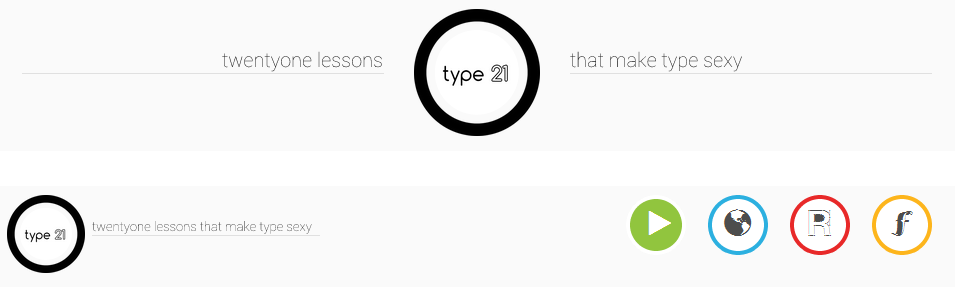

# AngularJS

> AngularJS is a MVC javascript framework for building web applications.
HTML is good for creating static websites is unable to provide features for dynamic content.

For the type21 project static HTML would work for the most part but in order to avoid repetitive code, keep development, maintenance and extensibility rather easy I decided to use a MVC pattern. 
This assures a seperation of concerns:

##Model
> The **model** keeps all the content or data. Thats why it often referred as the "data layer".

[JSON](http://en.wikipedia.org/wiki/Json "JSON") was chosen as a data format as its lightweight, easy to write and read. The basic data types like objects and arrays offer to realise the data structure for the type21 content:

The **courses** (courses.json) include information about the course name, course id and icon. These are used to display an overview on the homepage.

Each **course** (/course/<course>) has a description to give a brief overview about the topic and is subdivided in lessons.

**Lessons** hold data about each feature of a specific lesson like id, name and icon. The actual content is stored as a markdown file in order to keep the .json files short and allow flexibility in creating, editing and styling the content.

##View
> The **view** requests information from the model and renders it. It can be also seen as the User Interface (UI).

The entire website consists of basicly 3 Views

* **course-list** is the first site (homepage) with an overview of all courses
* **course-detail** lists information of a particular course
* **lesson** contains the lesson's content

These views are rendered by the [`ng-view`](http://docs.angularjs.org/api/ng.directive:ngView) directive into the main layout (`index.html`) according to the routes which are defined within the [`routeProvider`](http://docs.angularjs.org/api/ng.$routeProvider) (`/app/js/app.js`). The routeProvider defines the route, a template and a controller

* **route**: URL for deep-linking	
>`/courses`

* **template**: corresponding view
>`views/course-list.html`

* **controller**: logic and service to request data (`$http`)
>`CourseListCtrl`

Repetitive *elements* like the header and achivements (badge) are seperated in **partials** (/partials) and are included into the corresponding views.
As the homepage has a different header compared to the course details and lessons, the header section is seperated into *mainHeader* and *subHeader*.

##Control
>The control component manipulates the model and updates the view and includes the logic.

The [scope](http://docs.angularjs.org/guide/scope) for every controller is set within the `app.js` so every view has its own controller and requests the data from the data component.

Example
> `// get course list
    function CourseListCtrl($scope, $http) {
	$http.get("data/courses.json").success(function(data) {
		$scope.courses = data;
	});
}`

The controller requests course data (`$http.get`) and sets the $scope.courses to the data. This makes it possible to call `courses` within the view to retrieve the data to display name, icon, description etc.